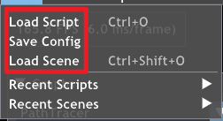
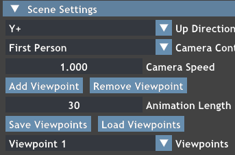
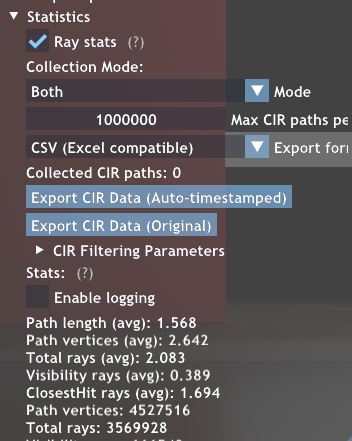

# Falcor光功率测量与CIR信道冲激响应系统使用指南

本系统基于Falcor 4.0框架，专门用于可见光通信（VLC）系统的光功率测量和信道冲激响应（CIR）分析。支持多种光源配置和灵活的视角管理。采用摄像机作为PD。

# 核心功能

### 1. 光功率测量（Light Power Measurement）

- **功能描述**: 实时计算和测量场景中的入射光功率
- **支持波长范围**: 380-780nm（可见光谱）
- **滤波模式**: 范围滤波、特定波段滤波
- **输出格式**: PNG、EXR、CSV、JSON多种格式

### 2. CIR信道冲激响应（Channel Impulse Response）

- **功能描述**: 计算可见光通信系统的信道冲激响应
- **路径数据**: 包含路径长度、发射角、接收角、反射次数等参数
- **输出格式**: TXT、CSV格式（默认），包含完整的静态参数

## 系统设置指南

### 1. 场景导入与设置

**导入场景文件**

- 支持标准的3D场景格式（.pbrt、.obj等）
- 在主界面通过File菜单导入场景

**场景基本设置**

- 确保场景具有适当的几何体和材质
- 建议在室内环境中测试VLC系统

### 2. 光源配置

系统支持多种光源类型，主要使用点光源（Point Light）：

#### 点光源参数设置

系统支持点光源，可在UI界面中调节以下参数：

- **功率 (Power)**: 以瓦特为单位的总辐射功率，范围0-10000W
- **世界位置 (World Position)**: 光源在3D空间中的位置坐标
- **方向 (Direction)**: 光源的发射方向
- **开口角 (Opening Angle)**: 光锥的张角，范围0-π弧度

**颜色设置**

- `Color`: RGB颜色控制
- `Intensity`: 光强度调节

**功率驱动模式**: 设置功率后，系统自动根据开口角计算强度

### 3. 摄像机设置

摄像机可以设置以下参数：

**位置 (Position)**: 摄像机在3D空间中的位置

**方向 (Direction)**: 摄像机的朝向

**目标点 (Target)**: 摄像机看向的目标位置

**上向量 (Up Vector)**: 定义摄像机的上方向

**视角管理**

- 支持添加、删除、选择视角点
- 视角数据自动保存摄像机的完整状态

#### 外部Viewpoint文件导入

每行数据格式如下：

```
timePoint, Transform(position = float3(x, y, z), target = float3(x, y, z), up = float3(x, y, z))
```

**参数说明：**

- `timePoint`: 时间点（浮点数）
- `position`: 摄像机位置坐标 (x, y, z)
- `target`: 摄像机目标点坐标 (x, y, z)
- `up`: 摄像机上方向向量 (x, y, z)

**示例数据：**

```
0, Transform(position = float3(0, 0.3, 10), target = float3(0, 0.3, 0), up = float3(0, 1, 0))
10, Transform(position = float3(-5.06638, 16.0821, 3.13346), target = float3(-5.05901, 15.1477, 2.77731), up = float3(6.18689e-05, 0.999996, -0.00299113))
```

#### 导入操作步骤

1. 在Scene Settings面板中找到viewpoint部分
2. 点击 `Load Viewpoints`按钮
3. 在文件对话框中选择viewpoint文件（.txt格式）
4. 系统自动解析并加载所有视角点
5. 加载成功后自动选择第一个视角点

## 运行时流程

### 1. 系统初始化

**加载渲染图和场景**

- 在左上角中加载渲染图
- 在左上角中加载场景



### 2. 光功率测量流程

选择渲染图：lncomingLightPowerExample.py

#### 单次测量

1. 设置光源参数（功率、位置、角度）
2. 配置波长滤波参数
3. 在 `IncomingLightPowerPass`面板中启用测量
4. 实时查看光功率分布图像
5. 导出测量数据

#### 批量测量（多视角）

1. 确保已加载viewpoint文件或设置多个视角点



1. 在 `IncomingLightPowerPass`面板中：
   - 点击 `Export All Viewpoints`
   - 选择输出格式（PNG、EXR、CSV、JSON）
   - 设置输出目录
2. 系统自动遍历所有视角进行测量
3. 每个视角的数据保存在独立文件夹中

**输出文件结构：**

```
output_directory/
├── viewpoint_1/
│   ├── power_timestamp.png
│   └── stats_timestamp.json
├── viewpoint_2/
│   ├── power_timestamp.png
│   └── stats_timestamp.json
└── ...
```

#### 光功率数据

- **总功率**: RGB三通道的总入射功率（瓦特）
- **平均功率**: 每像素平均功率（瓦特）
- **峰值功率**: 最大像素功率值（瓦特）

#### 其他功能

### 1. 波长滤波

- **范围滤波**: 设置最小和最大波长范围
- **特定波段**: 针对特定LED光谱进行滤波
- **可见光谱**: 自动限制在380-780nm范围内

### 2. 统计数据分析

- 实时显示光功率统计信息
- 包含总功率、平均功率、峰值功率
- 像素通过率和波长分布统计

### 3. 性能优化

- 支持统计频率调节（1-60帧）
- 批量导出时自动等待帧稳定
- 内存管理和数据缓存优化

### 3. CIR信道冲激响应测量

选择渲染图：PathTracer.py

1. 在Statistics里开启Ray stats选项
2. 触发CIR计算，数据自动导出，每次分析生成带时间戳的JSON文件



#### CIR数据格式

导出的CIR数据包含以下信息：

- 路径索引和像素坐标
- 路径长度（米）
- 发射角和接收角（弧度）
- 累计反射率成绩
- 反射次数
- 光路功率（瓦特）

**文件头部包含静态参数：**

- `A_receiver_area_m2`: 接收器有效面积
- `m_led_lambertian_order`: LED朗伯特阶数
- `c_light_speed_ms`: 光速
- `FOV_receiver_rad`: 接收器视场角
- `T_s_optical_filter_gain`: 光学滤波器增益
- `g_optical_concentration`: 光学浓缩增益

每条路径记录包含VLC信道建模所需的完整参数，可直接用于信道冲激响应的数值计算。

**性能优化建议：**

- 减少统计更新频率以提高帧率
- 使用较低分辨率进行初步测试
- 限制CIR路径数量以控制内存使用
